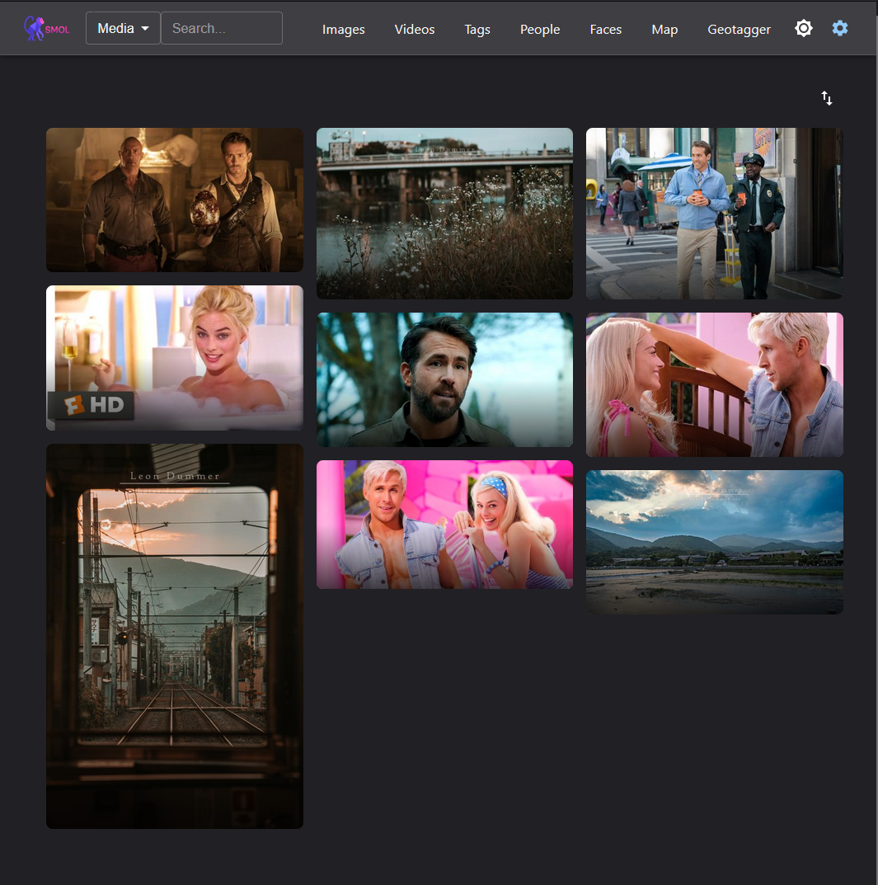
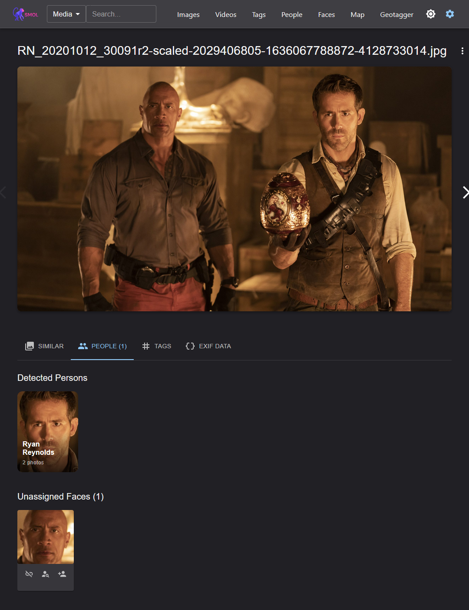
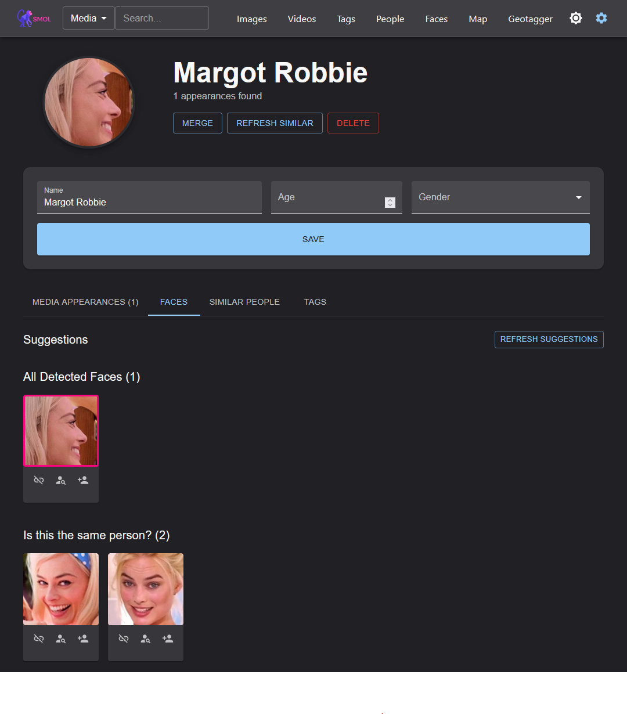
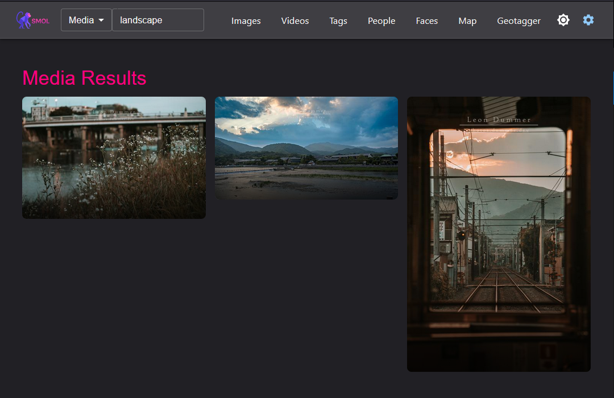
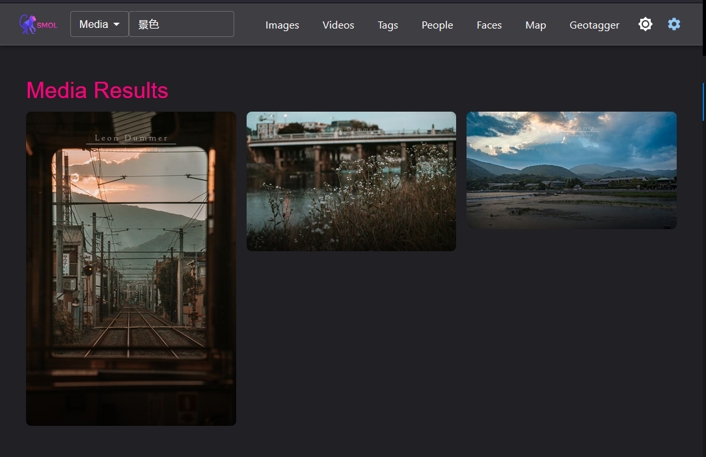
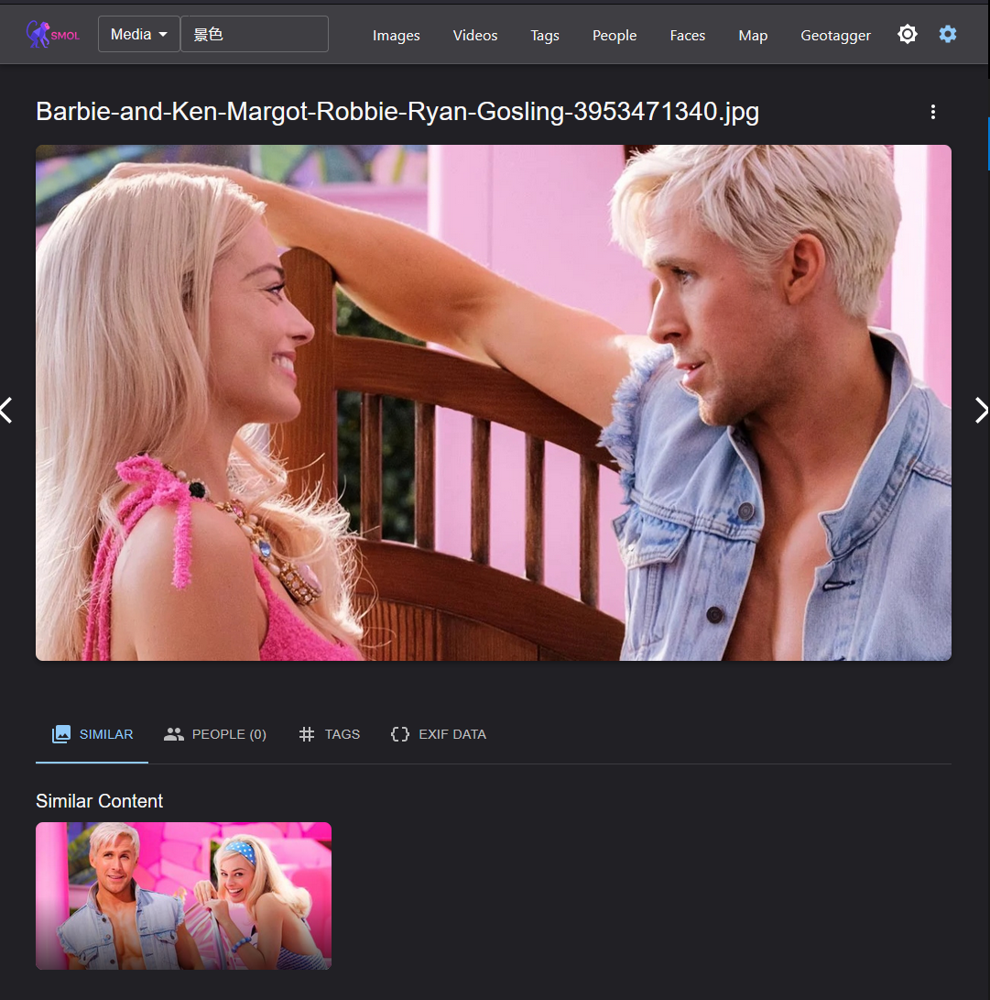
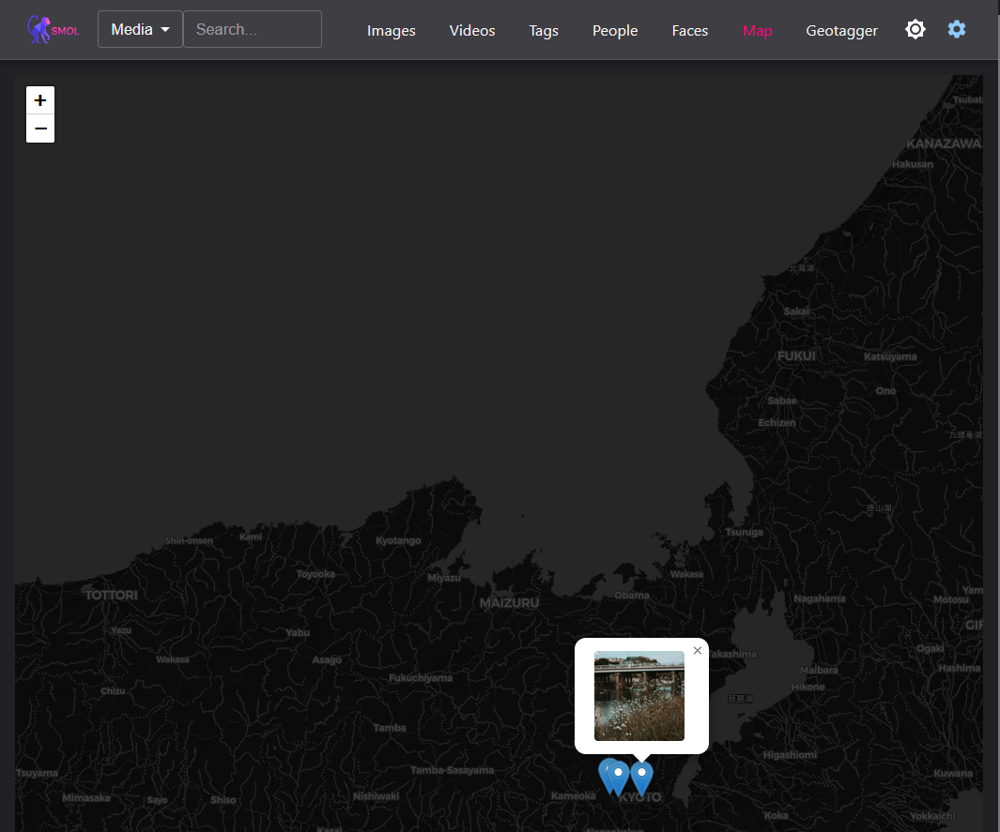

<div align="center">
  
</div>

# Smart Media Organizing Library

This project is a powerful, self-contained media management system designed to run as a standalone service. It brings advanced, AI-powered features like face recognition, multi-lingual full-text search, and similarity tracking directly to your personal photo and video collection, all without relying on external databases or APIs.

<a href="https://photos.dummer.dev">Read only Demo</a>



---

## Key Features

-   **Face Recognition & Person Tracking**
    -   Automatically detects faces in photos and videos.
    -   Groups faces belonging to the same person, allowing you to name and organize them.
    -   Tracks people across your entire media library to find all content they appear in.

    <br>
    
    
    <br>

-   **Multi-Lingual Full-Text Search**
    -   Supports multiple languages, allowing you to find media by what they depict, moods, etc

    <br>
    
    
    <br>

-   **Content-Based Similarity Search**
    -   Finds visually similar photos and videos, making it easy to discover related content or duplicates.

    <br>
    
    <br>

-   **Interactive Map & Geotagging**
    -   Displays all geotagged photos on an interactive world map.
    -   Includes a dedicated API endpoint to add or update GPS coordinates for your media.

    <br>
    
    <br>

-   **Advanced Media Processing**
    -   **Built-in Video Converter:** Convert videos into a web-compatible format for seamless playback with one click.
    -   **EXIF Processor:** Reads and displays detailed metadata (camera model, shutter speed, ISO, etc.) from your photos.

-   **Flexible Organization**
    -   **Free Tagging System:** Add any number of custom tags to your photos and videos for flexible organization.
    -   **Infinite Scroll:** A modern, infinite-scrolling library view for effortlessly browsing thousands of media files.
    -   **Read-Only Mode:** A special mode for secure, online presentation of your library without allowing changes.
    -   **Enable/Disable people** Only want to present your photos and videos without focusing on the people? No problem simply deactivate the recognition via env (ENABLE_PEOPLE=false)

---

## Getting Started

This application can be run directly on your machine or as a Docker container.

> For arm64 support, update the sqlite-vec version in the requirements.txt to 0.1.7a2 and use a locally build Dockerfile
 
### Without Docker (Directly on Host)

This method is ideal for a dedicated machine or standard development.

1.  **Create Environment File:**
    Copy the needed parameters from the template.env into the local.env
    and adjust the `MEDIA_DIR` to your media folder and the `DATA_DIR` to wherever
    you want to save the database, thumbnails, models etc.

2.  **Build the Application:**
    This command will install dependencies and compile the necessary components.
    ```bash
    make build
    ```

3.  **Run the Application:**
    Once the build is complete, start the server.
    ```bash
    make up
    ```

Your media manager should now be running and be accssible at **[http://localhost:8000](http://localhost:8000)**.

### With Docker (Recommended for Portability)

This is the easiest and most reliable way to run the application, as it includes all dependencies in a self-contained environment.

1.  **Create Environment File:**
    Just like the non-Docker setup, copy the template to create your local `smol.env` file.
    ```bash
    cp template.env smol.env
    ```

2.  **Configure Host Directories:**
    Open the `smol.env` file and make the following adjustments:
    -   Set `HOST_MEDIA_DIR` to the absolute path of your media library on your host machine.
    -   Set `HOST_DATA_DIR` to a path on your host machine where you want the application's database and index files to be stored persistently.

    ```env
    # Example:
    HOST_MEDIA_DIR=/home/user/Pictures
    HOST_DATA_DIR=/home/user/media_app_data
    ```

3.  **Start the Container:**
    This command will build the Docker image (if it doesn't exist) and start the container.
    ```bash
    make docker-start
    ```

4.  **Access the Application:**
    Your media manager will be available in your browser at Your media manager should now be running and be accssible at **[http://localhost:8000](http://localhost:8000)**


